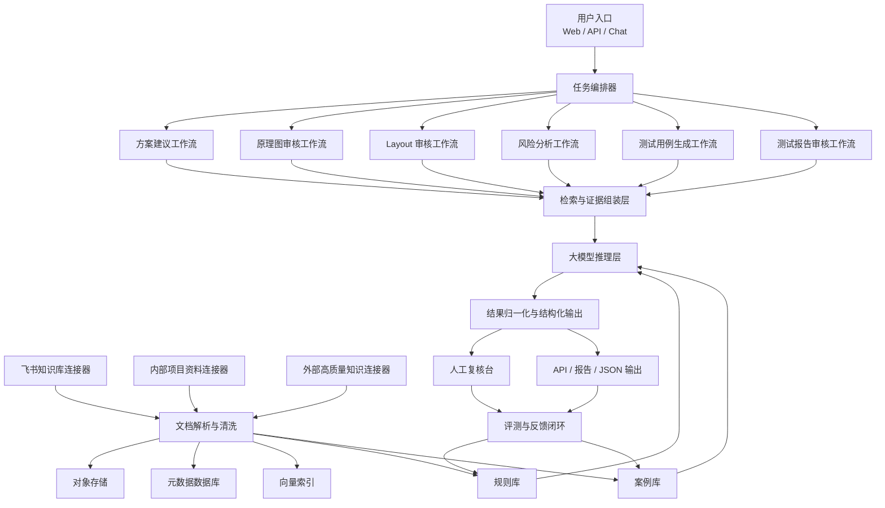
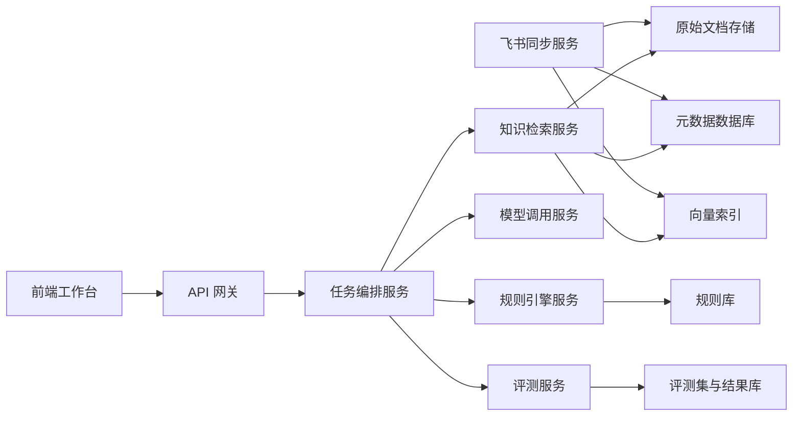

# 电机控制专家智能体架构方案（V0.1）

## 1. 总体原则

本系统采用“编排器 + 专业工作流 + 可信知识库 + 规则引擎 + 评测闭环”的架构，而不是单一大模型对话。

设计原则：

1. 检索优先，避免无依据回答
2. 规则兜底，避免关键问题漏检
3. 输出结构化，便于复核和集成
4. 所有结论可追溯到证据和版本
5. 模型与知识、规则、评测解耦，便于持续升级

---

## 2. 总体架构

---

## 3. 核心模块

### 3.1 任务编排器

职责：

1. 根据任务类型选择工作流
2. 对输入做资料完整性检查
3. 将任务拆分为若干子步骤
4. 汇总推理结果、规则结果和证据
5. 输出统一结构

建议输入参数：

1. `task_type`
2. `motor_type`
3. `project_context`
4. `artifacts`
5. `constraints`
6. `required_output_format`

### 3.2 专业工作流

每类任务不共享同一套 prompt，而是分别维护。

1. 方案建议
   - 关注拓扑、驱动方式、采样、保护、传感器、控制模式、热与 EMC 风险
2. 原理图审核
   - 关注电源链路、功率级、栅极驱动、采样、保护、接口、隔离、布局约束
3. Layout 审核
   - 关注大电流环路、开关节点、采样 Kelvin、隔离边界、敏感信号、散热铜皮与过孔
4. 风险分析
   - 关注故障模式、后果、可检测性和缓解动作
5. 测试用例生成
   - 关注覆盖性、边界工况、故障注入、保护触发、性能验证
6. 测试报告审核
   - 关注结论充分性、统计显著性、判据一致性、复现性

### 3.3 知识接入层

知识接入分三类：

1. 企业内部知识
   - 飞书 Wiki / Docs
   - 评审记录
   - 历史项目问题单
   - 测试报告与复盘
2. 结构化工程资料
   - BOM
   - 网表
   - 器件库
   - 项目配置表
3. 外部可信知识
   - TI / Microchip / ST / onsemi / Infineon 等官方资料
   - Datasheet
   - Application note
   - Reference design
   - 学术论文

### 3.4 文档解析与清洗层

目标是把非结构化资料转为可检索、可过滤、可引用的知识单元。

建议处理流程：

1. 文档抓取
2. 文档去重
3. 格式解析
4. 元数据提取
5. 内容切分
6. 质量打标
7. 向量化与索引

建议保留的关键元数据：

1. 来源类型
2. 文档标题
3. 发布日期
4. 版本号
5. 适用电机类型
6. 适用功率和电压范围
7. 拓扑标签
8. 厂商与器件系列
9. 权限级别
10. 可信度等级

### 3.5 检索与证据组装层

采用“混合检索”：

1. 元数据过滤
2. 关键词检索
3. 向量检索
4. 规则命中补充
5. 历史案例召回

检索输出不是直接给用户，而是形成“证据包”供后续推理：

1. 文档摘要
2. 关键片段
3. 证据位置
4. 证据可信度
5. 适用范围说明

### 3.6 规则引擎

规则引擎决定系统能否稳定像专家，而不是像一个会说话的搜索器。

建议按以下方式组织：

1. 按任务分类
2. 按电机类型分类
3. 按电气域分类
4. 按严重度分类
5. 按前置条件和触发条件分类

规则示例：

1. 高侧 bootstrap 供电回路缺少必要条件
2. 相电流采样与功率回流路径冲突
3. 栅极串阻、下拉、驱动能力与 MOSFET 电荷不匹配
4. DC Bus 电容离半桥过远
5. 分流电阻非 Kelvin 引出
6. 编码器接口缺少防护或共模控制
7. 保护链路不能覆盖短路、堵转、过温、欠压、过压

### 3.7 大模型推理层

大模型负责：

1. 任务理解
2. 多证据综合分析
3. 冲突信息裁决
4. 风险排序
5. 建议生成
6. 缺失信息识别

不建议让模型直接负责：

1. 全部规则判断
2. 所有事实来源选择
3. 高风险写操作
4. 版本控制和发布决策

### 3.8 人工复核台

高质量落地离不开 Human in the loop。

建议复核台支持：

1. 按严重度查看问题
2. 查看每条结论的来源证据
3. 接受、拒绝或修改建议
4. 标注误报与漏报
5. 沉淀专家反馈为规则或样本

### 3.9 评测与反馈闭环

所有版本升级前必须跑回归评测。

评测对象包括：

1. Prompt 版本
2. 模型版本
3. 规则版本
4. 知识索引版本
5. 解析器版本

---

## 4. 推荐技术栈

### 4.1 服务层

1. Python
2. FastAPI
3. 后台任务队列
   - Celery 或轻量队列

### 4.2 数据层

1. 对象存储
   - 原始文档、导出文件、报告附件
2. 元数据数据库
   - PostgreSQL
3. 向量索引
   - pgvector 或独立向量库

### 4.3 智能体层

1. OpenAI Responses API
2. 工具调用
3. 文件检索
4. MCP 或自定义工具服务

### 4.4 集成层

1. 飞书 OpenAPI
2. 企业文件系统或对象存储
3. 网页端工作台
4. CI/CD 与回归评测

---

## 5. 模型策略

### 5.1 模型分层

不要把所有任务都压给同一个模型。

建议分层：

1. 大模型
   - 用于复杂审核、证据综合、风险分析、方案建议
2. 小模型
   - 用于文档分类、标签提取、字段抽取、预筛查

### 5.2 模型升级策略

为了跟随大模型演进，必须做三层解耦：

1. Prompt 与模型解耦
2. 规则与模型解耦
3. 评测与模型解耦

每次模型升级流程：

1. 新模型接入沙箱环境
2. 跑标准评测集
3. 对比召回率、误报率、证据引用准确率
4. 若通过门槛则灰度切换
5. 保留回滚开关

---

## 6. 知识源策略

### 6.1 来源优先级

建议优先级从高到低如下：

1. 企业内部正式评审结论和验证报告
2. 器件 datasheet
3. 官方 reference design / application note
4. 厂商培训资料
5. 高质量学术论文
6. 普通网络内容

### 6.2 外部知识治理

外部资料不要直接信任，必须记录：

1. 来源域名
2. 文档发布日期
3. 文档类型
4. 是否官方
5. 是否经过人工确认

---

## 7. 安全与权限

1. 飞书文档同步服务只读
2. 企业内部资料按项目和角色授权
3. 输出结果保留审计日志
4. 外部知识与内部机密知识分开存储
5. 对写回业务系统的动作做显式审批

---

## 8. 参考部署拓扑

---

## 9. 第一阶段最小落地架构

如果要尽快起步，建议先做最小闭环：

1. 飞书文档只读同步
2. 企业历史文档入库
3. 方案建议工作流
4. 原理图审核工作流
5. 规则库 YAML 化
6. 统一 JSON 输出
7. 专家复核页面
8. 基础评测集

这个闭环一旦跑通，后续新增电机类型和任务类型的成本会显著下降。
