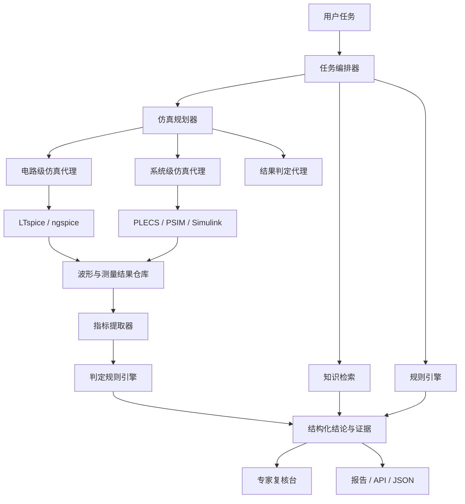

# 电机控制专家智能体 + 仿真接入详细方案（V0.1）

## 1. 目标

本文档定义如何将电路仿真和系统级电机驱动仿真纳入电机控制专家智能体，使系统不仅能“提出建议”，还能对关键设计假设进行自动验证。

目标如下：

1. 将仿真从人工离线活动升级为智能体可调用工具
2. 让仿真成为方案建议、原理图审核、风险分析、测试用例输出和测试报告审核的证据来源
3. 建立统一的仿真输入、运行、结果、结论、追溯链路
4. 支持随着模型和工具演进持续迭代，而不被某个单一模型或单一仿真平台绑定

---

## 2. 核心判断

### 2.1 仿真在本系统中的角色

仿真不是附属功能，而是“证据生成引擎”。

在该系统中：

1. 大模型负责理解任务、制定仿真计划、解释结果和生成建议
2. 仿真器负责数值求解和波形生成
3. 规则引擎负责指标判定、风险兜底和结果归类
4. 专家负责审批高风险结论和沉淀反馈

### 2.2 不建议做的事情

1. 不要让大模型直接代替 SPICE 求解器
2. 不要一开始追求“自动生成所有模型并全部可信”
3. 不要把仿真直接绑定到某一个闭源 EDA 工作流
4. 不要先做全栈 HIL/PHIL，建议先做离线批处理仿真闭环

### 2.3 建议的仿真分层

建议分成三层：

1. 电路级仿真
   - 栅极驱动
   - 保护链路
   - 采样前端
   - 电源与上电时序
2. 系统级仿真
   - 逆变器 + 电机 + 控制算法 + 负载 + 工况
3. 后续实时验证层
   - PIL / HIL / RT Box / 实机回放

第一阶段只做前两层。

---

## 3. 适用场景映射

### 3.1 设计方案建议

仿真作用：验证方案不是纸面正确，而是工况下可行。

建议纳入：

1. 母线电压范围扫描
2. 电机参数偏差扫描
3. 堵转 / 轻载 / 再生工况
4. 保护阈值与响应时间验证

### 3.2 原理图审核

仿真作用：对高风险点做重点复核，而不是全图一比一仿真。

建议纳入：

1. Bootstrap 裕量
2. 栅极过冲 / 振铃风险
3. 分流采样恢复时间
4. OCP / UVLO / OTP 链路逻辑
5. 运放饱和恢复

### 3.3 Layout 审核

仿真作用：结合寄生参数估算 layout 风险的严重度。

建议纳入：

1. 开关回路寄生电感敏感性分析
2. 栅极回路参数扫描
3. 分流 Kelvin 失真敏感性分析
4. 母线电容位置变化对过冲的影响

### 3.4 风险分析

仿真作用：把“担心会出问题”变成“在什么条件下出问题”。

建议纳入：

1. 故障注入
2. 参数极限扫描
3. 热漂 / 器件离散性 / 供电扰动场景

### 3.5 测试用例输出

仿真作用：自动枚举高收益测试工况。

建议纳入：

1. 从仿真波形中生成需要重点测的边界工况
2. 根据最脆弱参数组合生成测试优先级

### 3.6 测试报告审核

仿真作用：做“实测 vs 预期”差异解释。

建议纳入：

1. 对未覆盖工况做补充仿真
2. 对异常波形做原因假设排序
3. 判断报告结论是否足以外推到全工况

---

## 4. 推荐工具栈

## 4.1 电路级仿真工具

### A. LTspice

适合：

1. 栅极驱动
2. 采样前端
3. 保护链路
4. 厂商宏模型丰富的局部电路验证

优点：

1. 免费
2. 资料丰富
3. 对电源、模拟前端、驱动细节友好

局限：

1. 不适合承担完整电机系统级联合仿真主平台
2. 自动化集成能力不如纯脚本型工具自然

### B. ngspice

适合：

1. 自动化批量仿真
2. 参数扫描
3. 后端服务集成
4. 可脚本生成 netlist 的流程

优点：

1. 开源
2. 易于和 Python / 服务端集成
3. 适合做智能体工具调用

局限：

1. 厂商现成模型和 GUI 体验不如 LTspice
2. 团队上手门槛略高

### C. QSPICE / Xyce

适合：

1. 某些特定高性能或扩展求解场景
2. 研究或特定工程流补充

建议：

1. 第一阶段不作为主选型
2. 可在后续做对比验证

---

## 4.2 系统级仿真工具

### A. PLECS

适合：

1. 电力电子 + 控制 + 机械负载联合仿真
2. 三相逆变器、电机、负载、控制器协同分析
3. 参数扫描和工况切换

优点：

1. 对功率电子和驱动系统建模友好
2. 适合从方案建议延伸到系统级验证
3. 对完整 drive system 建模能力强

局限：

1. 商业授权成本
2. 团队需要建立统一模型规范

### B. Altair PSIM

适合：

1. 电机驱动与电力电子快速系统仿真
2. 设计验证和自动代码生成联动
3. Fault / Monte Carlo / Sensitivity 分析

优点：

1. 面向电机驱动和功率电子经验成熟
2. 对快速设计验证友好
3. 对自动化验证和 DFMEA 支撑较好

局限：

1. 商业授权成本
2. 需要形成企业内部模板库

### C. Simulink + Motor Control Blockset

适合：

1. 控制算法建模、调参、代码生成
2. MCU 部署和 PIL 联动
3. 和 TI C2000 等 MCU 工作流结合

优点：

1. 算法团队接受度通常较高
2. 对 FOC、弱磁、传感器、观测器建模友好
3. 适合后续延伸到代码生成与控制软件联动

局限：

1. 许可证成本高
2. 对板级局部电路细节仿真不是最佳主工具

---

## 4.3 第一阶段选型建议

如果你的目标是尽快落地，我建议：

1. 电路级主工具：`ngspice + LTspice`
2. 系统级主工具：`PLECS` 或 `PSIM`
3. 算法协同工具：`Simulink + Motor Control Blockset` 作为第二阶段接入

推荐优先次序：

1. 若团队重硬件与功率电子：`PLECS`
2. 若团队重快速验证与工程效率：`PSIM`
3. 若团队已有 MathWorks 资产：`Simulink + Motor Control Blockset`

---

## 5. 系统架构扩展

### 5.1 新增模块说明

1. 仿真规划器
   - 根据任务自动选择仿真类型、模型模板、参数扫描范围、判定指标
2. 模型装配器
   - 将原理图、器件参数、控制参数映射到仿真模板
3. 运行调度器
   - 排队执行本地或远端仿真任务
4. 指标提取器
   - 从波形中提取过冲、纹波、上升沿、恢复时间、稳态误差、THD 等
5. 结果判定器
   - 根据规格书、规则库和经验阈值判断 pass / risk / fail

---

## 6. 仿真工作流设计

### 6.1 通用工作流

1. 任务识别
2. 资料检查
3. 选择仿真模板
4. 绑定器件和参数
5. 生成仿真请求
6. 运行基线仿真
7. 执行参数扫描
8. 抽取关键指标
9. 与规则和规格比对
10. 输出结构化结论
11. 若不确定则升级人工复核

### 6.2 原理图审核中的仿真触发条件

建议只有命中高价值条件时才触发仿真，例如：

1. 三相逆变器功率级存在新拓扑
2. 栅极驱动关键参数缺少历史模板
3. 保护链路复杂或多重阈值级联
4. 采样前端可能饱和或抗干扰裕量不足
5. 专家规则判定为高风险但证据不足

### 6.3 设计方案建议中的仿真触发条件

1. 新电压等级
2. 新电机参数范围
3. 新型传感器方案
4. 高动态响应要求
5. 热与效率目标同时严格

---

## 7. 仿真模型策略

### 7.1 模型分级

建议将模型分成四级：

1. `L0` 概念验证模型
   - 用于方案阶段快速比较
2. `L1` 结构验证模型
   - 用于原理图风险验证
3. `L2` 参数化工程模型
   - 用于参数扫描和边界分析
4. `L3` 标定模型
   - 用于和实测数据对齐

### 7.2 模型模板化

不要让智能体每次从零造模型。

建议沉淀模板库：

1. 三相逆变器 + 低边单电阻采样
2. 三相逆变器 + 三电阻采样
3. 步进双 H 桥驱动
4. 伺服驱动 + 编码器反馈
5. 直线电机 + 位置反馈 + 速度环
6. 门极驱动局部子电路
7. 电流采样与保护局部子电路

模板内容建议包括：

1. 拓扑文件
2. 参数映射表
3. 默认扫描范围
4. 输出波形列表
5. 指标定义
6. 适用条件
7. 已知局限

---

## 8. 参数管理与扫描

### 8.1 关键参数分层

1. 设计输入参数
   - 母线电压、额定电流、开关频率、死区、栅阻、采样 RC
2. 电机参数
   - 相电阻、相电感、反电势常数、转动惯量、摩擦、极对数
3. 器件参数
   - MOSFET Qg、Rds_on、驱动电流、运放 GBW、比较器延时
4. 环境参数
   - 温度、电源波动、负载扰动
5. Layout 等效参数
   - 寄生电感、寄生电容、耦合系数

### 8.2 扫描模式

1. 单参数扫描
2. 多参数角点扫描
3. Monte Carlo
4. 故障注入
5. 温漂扫描
6. 工况序列扫描

### 8.3 第一阶段建议的默认扫描

1. 母线电压 ±10%
2. 电机相电感 ±20%
3. 死区 100ns 到 1us
4. 栅阻 2R 到 20R
5. 温度 25C / 85C / 125C
6. 分流误差与运放失调边界

---

## 9. 结果判定体系

### 9.1 指标类型

建议抽取三类指标：

1. 电气指标
   - 过冲、振铃、纹波、峰值电流、稳态误差、恢复时间
2. 控制指标
   - 转矩纹波、速度超调、位置误差、电流环跟踪误差
3. 风险指标
   - 保护误触发、保护漏触发、器件应力超限、稳定性裕量不足

### 9.2 判定等级

建议统一输出：

1. `pass`
2. `pass_with_margin_risk`
3. `risk`
4. `fail`
5. `inconclusive`

### 9.3 判定规则来源

1. 项目规格书
2. 企业设计规范
3. 厂商 reference design / datasheet
4. 专家经验阈值
5. 历史项目统计阈值

---

## 10. 智能体子代理设计

### 10.1 仿真规划代理

职责：

1. 识别是否需要仿真
2. 选择模板
3. 生成参数集
4. 定义输出指标和 pass criteria

### 10.2 网表 / 模型装配代理

职责：

1. 从结构化输入映射器件参数
2. 生成 netlist 或模型参数文件
3. 填充模板中的缺失项

### 10.3 仿真执行代理

职责：

1. 调用仿真器
2. 管理任务状态
3. 收集日志、波形、测量文件
4. 重试可恢复错误

### 10.4 波形分析代理

职责：

1. 抽取测量点
2. 计算关键指标
3. 识别异常模式
4. 对比基线与扫描结果

### 10.5 结论整合代理

职责：

1. 将仿真结论与知识检索结果整合
2. 形成最终发现和建议
3. 生成面向工程师的解释文本

---

## 11. 与现有六类任务的整合方式

### 11.1 方案建议

输出新增：

1. 推荐仿真清单
2. 关键工况矩阵
3. 方案 A / B 仿真比较
4. 风险最大参数组合

### 11.2 原理图审核

输出新增：

1. 被仿真复核的高风险点列表
2. 每个点的仿真结论
3. 建议补充的测量点

### 11.3 Layout 审核

输出新增：

1. 寄生参数敏感性结论
2. 对布局变更优先级排序

### 11.4 风险分析

输出新增：

1. 可复现风险场景
2. 风险触发窗口
3. 缓解措施的仿真验证证据

### 11.5 测试用例输出

输出新增：

1. 从仿真中推导的优先测试项
2. 推荐示波器通道、触发条件和判据

### 11.6 测试报告审核

输出新增：

1. 仿真和实测差异表
2. 未覆盖工况清单
3. 是否允许外推结论

---

## 12. 第一阶段推荐实施路线

### 12.1 4 周基础期

1. 选定仿真主工具
2. 定义统一仿真 I/O Schema
3. 建立首批 5 个模板
4. 完成仿真调度服务雏形

### 12.2 4 周闭环期

1. 接入原理图审核工作流
2. 接入方案建议工作流
3. 跑通自动参数扫描和结果判定
4. 输出统一 JSON

### 12.3 4 周扩展期

1. 扩展到风险分析
2. 扩展到测试用例输出
3. 建立仿真评测集
4. 和专家复核台联动

---

## 13. 团队分工建议

1. 硬件专家
   - 定义电路级模板和指标
2. 控制算法专家
   - 定义系统级模型和控制工况
3. 平台工程师
   - 搭建调度、存储、接口和权限
4. AI 工程师
   - 负责编排、提示词、规则、评测和结果整合
5. 测试工程师
   - 将仿真结论转成实测用例和判据

---

## 14. MVP 决策建议

如果你现在就要启动，我建议优先做以下闭环：

1. 电机类型
   - BLDC / PMSM
2. 仿真工具
   - `ngspice` 用于局部电路
   - `PLECS` 或 `PSIM` 用于系统级联合仿真
3. 任务类型
   - 方案建议
   - 原理图审核
   - 风险分析
4. 首批重点问题
   - Bootstrap 裕量
   - 栅极振铃和过冲
   - 相电流采样失真
   - OCP / UVLO / 堵转保护
   - 母线纹波与电容选型
   - 启动 / 堵转 / 再生工况稳定性

这是最容易形成差异化能力、也最容易看到业务价值的一条路。

---

## 15. 结论

把仿真纳入智能体后，系统会从“知识型助手”升级为“证据驱动的工程专家系统”。

第一阶段最重要的不是接入最多的工具，而是打通这条闭环：

1. 智能体决定仿真什么
2. 仿真器给出结果
3. 规则引擎做判定
4. 智能体把结果转成工程建议
5. 专家反馈进入模板库和评测集

一旦这条闭环稳定，你的系统就具备了持续演进的基础。
