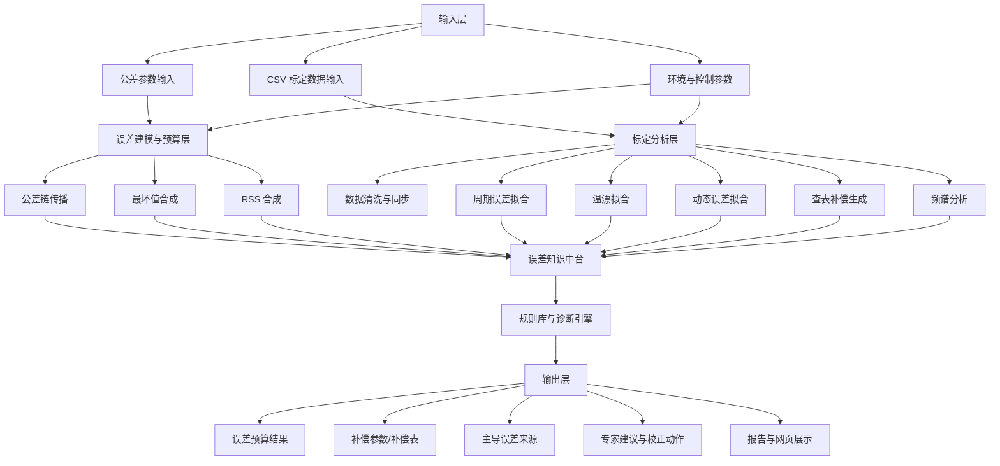
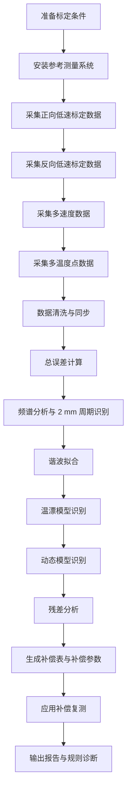
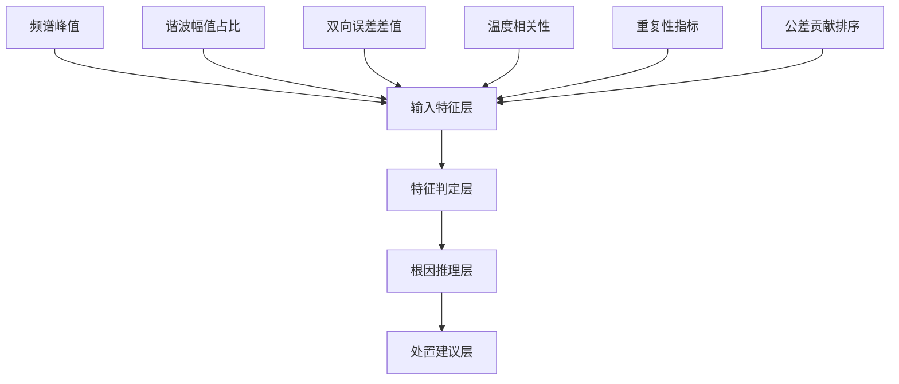

# 直线电机运动精度估算与校正专家系统总体方案书

## 1. 目标与适用范围

本系统面向采用磁栅尺作为位置传感器的直线电机平台，重点处理以下两类工程场景：

1. 方案设计阶段
   在没有标定 CSV 的情况下，根据零部件制造公差、装配公差和环境条件，进行运动精度预算、误差贡献分解和方案敏感度分析。

2. 样机调试与交付阶段
   在获得激光干涉仪、高精度参考尺或等效参考测量数据后，对整机误差进行分解、识别、补偿和诊断。

系统默认磁栅尺磁极距为 `2 mm`，因此所有周期误差识别与补偿均围绕 `2 mm` 基波及其谐波展开。

---

## 2. 总体架构

### 2.1 系统定位

系统采用“模型驱动 + 数据驱动 + 规则驱动”的混合架构：

- 模型驱动：建立误差传播模型和补偿模型
- 数据驱动：利用公差参数或标定数据识别关键误差项
- 规则驱动：根据误差特征给出根因诊断与校正建议

### 2.2 模块图



### 2.3 功能模块划分

#### 2.3.1 输入层

- 公差输入模块
  - 行程
  - 磁极距
  - 磁栅累计节距误差
  - 周期误差
  - 细分误差
  - 导轨直线度
  - 安装平面度
  - 装配平行度
  - Abbe 偏置
  - 角度误差
  - 温差
  - 线膨胀系数
  - 伺服跟随误差
  - 测量链不确定度

- 标定数据输入模块
  - `position_mm`
  - `sensor_position_mm`
  - `reference_position_mm`
  - `velocity_mm_s`
  - `temperature_c`
  - `direction`

#### 2.3.2 建模与分析层

- 公差预算模块
- 误差分解模块
- 谐波拟合模块
- 动态误差建模模块
- 温漂建模模块
- 查表补偿模块
- 频谱分析模块

#### 2.3.3 决策与输出层

- 规则推理模块
- 补偿建议模块
- 校正流程推荐模块
- 报告生成模块

---

## 3. 误差方程体系

### 3.1 总误差方程

直线电机位置误差可统一表示为：

\[
e(x,v,a,T)=e_{\text{geo}}(x)+e_{\text{cyclic}}(x)+e_{\text{dyn}}(v,a)+e_{\text{thermal}}(x,T)+e_{\text{meas}}
\]

其中：

- `x`：位置
- `v`：速度
- `a`：加速度
- `T`：温度或温差状态

各分量含义如下：

- `e_geo(x)`：几何与制造误差
- `e_cyclic(x)`：磁极距相关周期误差
- `e_dyn(v,a)`：动态跟随误差
- `e_thermal(x,T)`：热误差
- `e_meas`：测量链误差与不确定度

### 3.2 几何与制造误差项

\[
e_{\text{geo}}(x)=e_{\text{pitch}}(x)+e_{\text{straight}}(x)+e_{\text{mount}}(x)+e_{\text{assy}}(x)+e_{\text{Abbe}}(x)
\]

建议拆分为：

- `e_pitch(x)`：磁栅累计节距误差
- `e_straight(x)`：导轨直线度误差
- `e_mount(x)`：安装平面度引起的误差
- `e_assy(x)`：装配平行度、相对偏摆误差
- `e_Abbe(x)`：Abbe 偏置放大后的角度误差

Abbe 误差近似表达式：

\[
e_{\text{Abbe}}(x)\approx h \cdot \theta(x)
\]

其中：

- `h`：Abbe 偏置，单位 mm
- `θ(x)`：角度误差，单位 rad

若输入角度单位为角秒，则：

\[
\theta_{\text{rad}}=\theta_{\text{arcsec}}\cdot \frac{\pi}{180\times3600}
\]

### 3.3 周期误差项

由于磁极距为 `τ = 2 mm`，周期误差按傅里叶级数建模：

\[
e_{\text{cyclic}}(x)=\sum_{n=1}^{N}\left[A_n\sin\left(\frac{2\pi n}{\tau}x\right)+B_n\cos\left(\frac{2\pi n}{\tau}x\right)\right]
\]

其中：

- `τ = 2 mm`
- `n = 1, 2, ..., N`
- `A_n, B_n`：待识别的谐波系数

物理上：

- 一次项通常对应 `2 mm` 基波周期误差
- 二次及以上谐波通常对应磁场失真、细分非线性、安装偏摆等

### 3.4 动态误差项

动态误差建议采用线性近似模型：

\[
e_{\text{dyn}}(v,a,d)=c_0+c_1v+c_2a+c_3d
\]

其中：

- `d`：方向变量，正向取 `+1`，反向取 `-1`
- `c_0`：静态偏置
- `c_1`：速度相关系数
- `c_2`：加速度相关系数
- `c_3`：方向相关系数

### 3.5 热误差项

热误差一阶近似模型：

\[
e_{\text{thermal}}(x,T)=k_T \cdot (T-T_0)
\]

若考虑结构长度与材料膨胀系数，则：

\[
e_{\text{thermal}} \approx L \cdot \alpha \cdot \Delta T
\]

其中：

- `L`：有效长度
- `α`：线膨胀系数
- `ΔT`：温差

在单位换算到微米后可写为：

\[
e_{\text{thermal,um}} \approx L_{\text{mm}} \cdot \alpha_{\text{ppm/C}} \cdot \Delta T / 1000
\]

### 3.6 测量链误差与综合不确定度

综合不确定度建议采用 RSS 合成：

\[
u_c=\sqrt{u_{\text{ref}}^2+u_{\text{repeat}}^2+u_{\text{fit}}^2+u_{\text{env}}^2}
\]

扩展不确定度：

\[
U \approx k \cdot u_c
\]

通常工程上取 `k = 2`。

---

## 4. 方案阶段误差预算模型

### 4.1 公差链输入项

建议以以下误差源作为一级输入：

1. 磁栅累计节距误差
2. 磁栅周期误差
3. 细分/插值误差
4. 导轨直线度
5. 安装平面度
6. 装配平行度
7. Abbe 偏置
8. 角度误差
9. 热伸缩误差
10. 伺服跟随误差
11. 测量链不确定度

### 4.2 合成方式

最坏值合成：

\[
E_{\text{worst}}=\sum_{i=1}^{m}|e_i|
\]

RSS 合成：

\[
E_{\text{rss}}=\sqrt{\sum_{i=1}^{m}e_i^2}
\]

### 4.3 输出内容

- 最坏值误差上限
- RSS 误差估计
- 主导误差贡献排序
- 几何误差占比
- 周期误差占比
- 热误差占比
- 建议优先优化项

---

## 5. 标定与校正流程

### 5.1 总体流程图



### 5.2 标定步骤说明

#### 步骤 1：准备阶段

- 确定行程范围
- 确定参考仪器
- 确定环境温度与稳定时间
- 确定低速、中速和高速测试点

#### 步骤 2：静态低速标定

目标：

- 提取几何误差与周期误差
- 降低动态误差影响

建议：

- 正反向分别采样
- 每点多次重复
- 保证速度平稳、振动尽量小

#### 步骤 3：双向误差测试

目标：

- 识别摩擦、反向死区、结构弹性回差

输出：

- 正向误差曲线
- 反向误差曲线
- 双向均值差

#### 步骤 4：多速度测试

目标：

- 建立速度和加速度相关误差模型

输出：

- `c1, c2, c3` 等动态模型参数

#### 步骤 5：多温度点测试

目标：

- 建立温漂补偿系数

输出：

- `kT`
- 参考温度 `T0`

#### 步骤 6：补偿生成

补偿按两级结构实现：

1. 解析型周期补偿
2. 分段位置查表补偿

周期补偿：

\[
\hat e_{\text{cyclic}}(x)=\sum_{n=1}^{N}\left[\hat A_n\sin\left(\frac{2\pi n}{2}x\right)+\hat B_n\cos\left(\frac{2\pi n}{2}x\right)\right]
\]

查表补偿：

- 固定间距采样补偿值
- 运行时线性插值

#### 步骤 7：复测验证

验证指标建议包括：

- 补偿前峰峰值
- 补偿后峰峰值
- 残差 RMSE
- 重复性
- 扩展不确定度

---

## 6. 规则库框架设计

### 6.1 规则库目标

规则库用于回答三个问题：

1. 哪类误差在主导系统精度
2. 误差最可能来自哪个环节
3. 下一步应优先采取哪种校正动作

### 6.2 规则库分层

规则库建议分为四层：



### 6.3 规则输入特征

建议的规则特征包括：

- 一次谐波幅值
- 二次谐波幅值占比
- `0.5 cycle/mm` 频谱峰值
- 正反向误差均值差
- 温度相关系数
- 重复性指标
- 几何误差占比
- 热误差占比
- 公差主导项名称

### 6.4 规则模板

规则统一建议采用：

```text
IF [条件]
THEN [根因判断]
AND [建议动作]
PRIORITY [优先级]
```

### 6.5 典型规则示例

#### 规则 1：2 mm 基波周期误差

```text
IF 一次谐波幅值 >= 阈值
AND 主频接近 0.5 cycle/mm
THEN 判定磁极距同步周期误差显著
AND 建议检查磁头安装高度、正交性、幅值平衡与细分线性
PRIORITY 高
```

#### 规则 2：高次谐波畸变

```text
IF 二次谐波幅值 > 一次谐波幅值的 30%
THEN 判定磁场畸变或细分非线性风险较高
AND 建议检查磁头偏摆、气隙波动、细分算法
PRIORITY 中
```

#### 规则 3：双向误差显著

```text
IF 正反向误差均值差 >= 阈值
THEN 判定存在回差、摩擦或结构弹性问题
AND 建议建立双向补偿表并复核机械传动与控制参数
PRIORITY 中
```

#### 规则 4：热误差显著

```text
IF 温度相关性 >= 阈值
OR 热误差占比 >= 阈值
THEN 判定温漂不可忽略
AND 建议增加温度传感器、环境控制和温漂补偿模型
PRIORITY 中
```

#### 规则 5：重复性不足

```text
IF 重复性指标 >= 阈值
THEN 判定当前标定数据可信度不足
AND 建议先排查测量系统、振动和装配松动
PRIORITY 高
```

#### 规则 6：几何误差主导

```text
IF 导轨直线度 + 安装平面度 + 装配平行度 + Abbe 误差 占总误差比例较大
THEN 判定几何装配误差主导
AND 建议优先优化基面加工、导轨装配和基准设计
PRIORITY 高
```

### 6.6 规则输出格式

规则输出建议至少包含：

- 规则编码
- 严重等级
- 诊断描述
- 推荐动作
- 推荐优先级
- 相关特征值

示例：

```json
{
  "code": "CYCLIC_2MM",
  "severity": "high",
  "message": "检测到与 2 mm 磁极距同步的显著周期误差",
  "action": "检查磁头安装高度、相位正交性和细分链路线性",
  "priority": 1
}
```

---

## 7. 数据结构建议

### 7.1 配置对象

- 系统配置
- 阈值配置
- 标定参数配置

### 7.2 分析结果对象

建议包含：

- `summary`
- `harmonic_terms`
- `lookup_table`
- `dynamic_model`
- `thermal_model`
- `spectrum_peaks`
- `diagnostics`
- `samples`

### 7.3 公差预算结果对象

建议包含：

- 输入参数快照
- 最坏值结果
- RSS 结果
- 误差贡献列表
- 主导误差项
- 规则诊断结果
- 预计误差包络样本点

---

## 8. 实施建议

### 8.1 第一阶段：方案版

优先实现：

- 公差输入
- 最坏值与 RSS 合成
- 主导误差排序
- User Manual
- 基础规则诊断

### 8.2 第二阶段：标定版

补充实现：

- CSV 数据导入
- 谐波拟合
- FFT 分析
- 温漂与动态误差建模
- 查表补偿生成

### 8.3 第三阶段：工程版

进一步扩展：

- 双向补偿表
- 分速度段补偿
- 多温区补偿
- 报告导出
- 权限化参数模板

---

## 9. 当前原型与方案对应关系

当前原型已经覆盖以下核心能力：

- 公差预算与误差贡献分解
- 2 mm 周期误差建模
- CSV 标定分析
- 规则诊断
- 网页端展示

尚可继续加强的能力包括：

- 更细的几何误差链模型
- 双向补偿
- 多轴联动误差建模
- 更正式的报告模板

---

## 10. 结论

本系统的设计重点不是单纯“算一个误差值”，而是建立一个从方案设计、样机标定到补偿诊断的统一框架：

- 设计阶段用公差链做误差预算
- 标定阶段用数据分解识别误差来源
- 校正阶段用解析补偿和查表补偿联合修正
- 诊断阶段用规则库自动输出优先整改建议

对于磁极距 `2 mm` 的磁栅尺直线电机，这种架构能够把周期误差、累计误差、几何装配误差、热误差和动态误差统一到一个专家系统中，具备较好的工程实用性和可扩展性。
