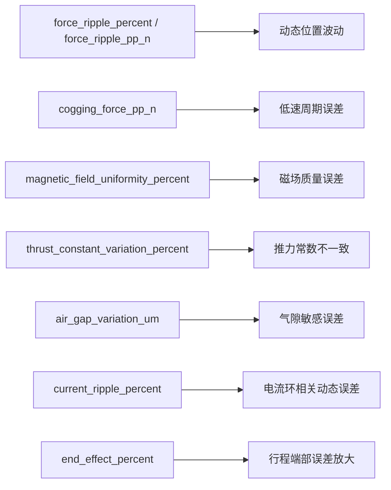

# 电机系统运动精度估算与校正智能体
## 总体方案书 V2：纳入推力波动与磁场质量

## 1. 本次升级结论

V1 版本的精度估算主要覆盖：

- 几何制造误差
- 传感器误差
- 温漂误差
- 动态跟随误差
- 测量链误差

但对于采用直线电机的系统，如果目标是“运动精度专家系统”而非“静态位置误差粗估器”，则以下两类因素必须正式纳入：

- 推力波动
- 磁场质量

原因是这两类因素不仅影响动态误差，还会与传感器周期误差、装配误差和控制误差耦合，形成稳定的周期残差、低速不匀速、往返误差放大和重复性下降。

因此，V2 版本将误差模型从“几何-传感器主导”升级为“几何 + 传感器 + 电磁 + 控制 + 热”的统一框架。

---

## 2. 新版误差树

```mermaid
flowchart TD
    A["总位置误差 e"] --> B["几何与制造误差"]
    A --> C["传感器与读数误差"]
    A --> D["电磁误差"]
    A --> E["控制与动态误差"]
    A --> F["热误差"]
    A --> G["测量链误差"]

    B --> B1["磁栅累计节距误差"]
    B --> B2["导轨直线度"]
    B --> B3["安装平面度"]
    B --> B4["装配平行度"]
    B --> B5["Abbe 误差"]

    C --> C1["2 mm 基波周期误差"]
    C --> C2["细分/插值误差"]
    C --> C3["相位误差"]
    C --> C4["幅值不平衡"]
    C --> C5["读头安装间隙变化"]

    D --> D1["推力波动"]
    D --> D2["齿槽力/定位力"]
    D --> D3["磁场均匀性"]
    D --> D4["推力常数波动"]
    D --> D5["气隙变化"]
    D --> D6["端部效应"]
    D --> D7["磁场谐波"]

    E --> E1["速度跟随误差"]
    E --> E2["加速度跟随误差"]
    E --> E3["反向死区"]
    E --> E4["电流纹波"]
    E --> E5["带宽不足"]
    E --> E6["结构共振激励"]

    F --> F1["热伸缩"]
    F --> F2["温漂"]
    F --> F3["磁性能温度漂移"]

    G --> G1["参考仪器不确定度"]
    G --> G2["环境补偿残差"]
    G --> G3["重复性误差"]
```



---

## 3. 新版误差方程

## 3.1 总误差方程

\[
e(x,v,a,T,i)=e_{geo}(x)+e_{sensor}(x)+e_{em,static}(x)+e_{em,dyn}(x,v,i)+e_{servo}(v,a,i)+e_{thermal}(x,T)+e_{meas}
\]

其中：

- `x`：位置
- `v`：速度
- `a`：加速度
- `T`：温度或温差状态
- `i`：电流相关状态

---

## 3.2 几何误差项

\[
e_{geo}(x)=e_{pitch}(x)+e_{straight}(x)+e_{mount}(x)+e_{assy}(x)+e_{Abbe}(x)
\]

其中：

- `e_pitch(x)`：累计节距误差
- `e_straight(x)`：导轨直线度误差
- `e_mount(x)`：安装平面度误差
- `e_assy(x)`：装配平行度与偏摆误差
- `e_Abbe(x)`：Abbe 误差

Abbe 误差近似：

\[
e_{Abbe}(x)\approx h\cdot \theta(x)
\]

---

## 3.3 传感器误差项

磁极距为 `2 mm` 时：

\[
e_{sensor}(x)=\sum_{n=1}^{N}\left[A_n\sin\left(\frac{2\pi n}{2}x\right)+B_n\cos\left(\frac{2\pi n}{2}x\right)\right]
\]

这一项仍然保留，但在 V2 中不再默认把所有周期误差都归因到磁栅尺，而是与电磁周期误差共同判别。

---

## 3.4 电磁静态误差项

\[
e_{em,static}(x)=e_{cog}(x)+e_{kf}(x)+e_{gap}(x)+e_{end}(x)
\]

其中：

- `e_cog(x)`：齿槽力或定位力引起的位置周期误差
- `e_kf(x)`：推力常数波动引起的位置敏感性变化
- `e_gap(x)`：气隙变化引起的推力不均匀
- `e_end(x)`：行程端部磁场畸变或端部效应

建议将其写成谐波形式：

\[
e_{em,static}(x)=\sum_{m=1}^{M}\left[C_m\sin\left(2\pi f_m x\right)+D_m\cos\left(2\pi f_m x\right)\right]
\]

这里的 `f_m` 不一定等于传感器 `0.5 cycle/mm`，还可能来自电机极距、齿槽周期和磁场谐波周期。

---

## 3.5 电磁动态误差项

\[
e_{em,dyn}(x,v,i)=k_r\cdot F_{ripple}(x,i)\cdot G(v)+k_b\cdot \Delta B(x)+k_i\cdot I_{ripple}
\]

其中：

- `F_ripple(x,i)`：推力波动
- `ΔB(x)`：磁场质量偏差或磁密不均匀
- `I_ripple`：电流纹波
- `G(v)`：速度敏感函数

工程上可以进一步线性化为：

\[
e_{em,dyn}=c_4R_{pp}+c_5\Delta B+c_6\Delta g+c_7I_{ripple}
\]

---

## 3.6 控制与动态误差项

\[
e_{servo}(v,a,d)=c_0+c_1v+c_2a+c_3d
\]

其中 `d` 为方向变量。

V2 中这一项与电磁动态误差分开建模，因为：

- V1 中很多速度误差会被归到 `e_servo`
- V2 需要把“控制器问题”和“电磁侧扰动”区分开

---

## 3.7 热误差项

\[
e_{thermal}(x,T)=k_T(T-T_0)+L\cdot \alpha \cdot \Delta T
\]

V2 中还建议补一项：

\[
e_{mag,T}(T)
\]

用于表示磁钢、推力常数或磁场质量随温度漂移的影响。

---

## 4. 新版输入参数表

## 4.1 基础参数组

这组参数保留现有网页的主表单：

- `stroke_mm`
- `pole_pitch_mm`
- `scale_pitch_accuracy_um_per_m`
- `scale_cyclic_um`
- `interpolation_error_um`
- `guide_straightness_um`
- `mounting_flatness_um`
- `assembly_parallelism_um`
- `abbe_offset_mm`
- `angular_error_arcsec`
- `thermal_delta_c`
- `thermal_expansion_ppm_c`
- `servo_following_um`
- `measurement_uncertainty_um`

---

## 4.2 新增电磁误差参数组

建议新增一组“高级电磁参数”，默认折叠显示。

### 一级必加参数

1. `force_ripple_percent`
   推力波动率，单位 `%`

2. `force_ripple_pp_n`
   推力波动峰峰值，单位 `N`

3. `cogging_force_pp_n`
   齿槽力或定位力峰峰值，单位 `N`

4. `magnetic_field_uniformity_percent`
   磁场均匀性偏差，单位 `%`

5. `thrust_constant_variation_percent`
   推力常数波动，单位 `%`

6. `air_gap_variation_um`
   气隙变化量，单位 `um`

### 二级建议参数

7. `motor_pole_pitch_mm`
   电机磁极距，单位 `mm`

8. `magnetic_harmonic_percent`
   磁场谐波含量，单位 `%`

9. `end_effect_percent`
   端部效应强度，单位 `%`

10. `current_ripple_percent`
   电流纹波，单位 `%`

11. `back_emf_harmonic_percent`
   反电势谐波含量，单位 `%`

12. `magnetic_temp_drift_percent_per_c`
   磁性能温漂，单位 `%/C`

---

## 4.3 新增参数与误差映射关系



---

## 5. 新版规则库扩展

## 5.1 规则库总体结构

V2 规则库建议扩展成 5 类：

1. 传感器周期误差规则
2. 几何装配误差规则
3. 电磁误差规则
4. 控制动态误差规则
5. 热误差规则

---

## 5.2 新增电磁规则

### 规则 E1：周期误差非传感器独占

```text
IF 补偿传感器 2 mm 周期项后仍存在显著稳定周期残差
THEN 判定误差中存在电磁周期成分
AND 建议检查齿槽力、推力波动、磁场谐波
PRIORITY 高
```

### 规则 E2：低速不匀速

```text
IF 低速误差明显大于中高速误差
AND 正反向都出现周期性微幅波动
THEN 优先怀疑齿槽力或推力波动
AND 建议增加 cogging_force_pp_n 和 force_ripple_percent 参数建模
PRIORITY 高
```

### 规则 E3：极距/齿槽频率关联

```text
IF 频谱主峰与电机极距周期或齿槽周期一致
THEN 判定为电机电磁侧主导误差
AND 建议检查磁场均匀性、推力常数波动和气隙变化
PRIORITY 高
```

### 规则 E4：负载敏感放大

```text
IF 负载变化后误差显著放大
AND 传感器误差谱基本不变
THEN 优先怀疑推力常数波动或推力储备不足
AND 建议检查 thrust_constant_variation_percent
PRIORITY 中
```

### 规则 E5：端部误差放大

```text
IF 行程端部误差明显大于中间行程
THEN 优先怀疑端部效应或端部磁场畸变
AND 建议引入 end_effect_percent
PRIORITY 中
```

### 规则 E6：温度升高后动态误差恶化

```text
IF 温升后动态误差和周期残差同步增大
THEN 怀疑磁性能温漂与电流环热漂耦合
AND 建议检查 magnetic_temp_drift_percent_per_c
PRIORITY 中
```

---

## 5.3 新版输出结论类别

专家系统输出建议新增以下诊断标签：

- `ELECTROMAGNETIC_RIPPLE_DOMINANT`
- `COGGING_FORCE_RISK`
- `MAGNETIC_FIELD_QUALITY_RISK`
- `AIR_GAP_SENSITIVITY_RISK`
- `END_EFFECT_RISK`
- `THRUST_CONSTANT_VARIATION_RISK`

---

## 6. 网页端字段建议

## 6.1 首页结构建议

首页建议改成三层：

1. 基础参数区
2. 高级电磁参数区
3. 结果与诊断区

---

## 6.2 建议字段分组

### A. 基础误差参数

- 行程
- 磁极距
- 磁栅累计节距误差
- 磁栅周期误差
- 细分误差
- 导轨直线度
- 安装平面度
- 装配平行度
- Abbe 偏置
- 角度误差
- 温差
- 线膨胀系数
- 伺服跟随误差
- 测量链不确定度

### B. 高级电磁参数

- 推力波动率 `%`
- 推力波动峰峰值 `N`
- 齿槽力峰峰值 `N`
- 磁场均匀性 `%`
- 推力常数波动 `%`
- 气隙变化 `um`
- 电机极距 `mm`
- 磁场谐波 `%`
- 端部效应 `%`
- 电流纹波 `%`
- 反电势谐波 `%`
- 磁性能温漂 `%/C`

### C. 结果输出区

- 最坏值误差
- RSS 误差
- 主导误差源
- 周期误差占比
- 几何误差占比
- 电磁误差占比
- 热误差占比
- 专家建议

---

## 6.3 网页端交互建议

建议新增一个开关：

- `启用高级电磁误差建模`

开启后显示电磁参数区；关闭时保持当前简化模型。

还建议新增两个结果卡片：

- `电磁误差贡献`
- `低速平稳性风险`

---

## 7. 估算逻辑升级建议

## 7.1 V1 到 V2 的逻辑差别

V1：

\[
E_{total}\approx E_{geo}+E_{sensor}+E_{servo}+E_{thermal}+E_{meas}
\]

V2：

\[
E_{total}\approx E_{geo}+E_{sensor}+E_{em}+E_{servo}+E_{thermal}+E_{meas}
\]

其中：

\[
E_{em}=\sqrt{E_{force\ ripple}^2+E_{cogging}^2+E_{field}^2+E_{gap}^2+E_{end}^2}
\]

---

## 7.2 初步工程估算建议

在没有完整实测数据时，可以先把电磁误差近似映射成位置误差等效项：

\[
E_{force\ ripple,pos} \approx k_{fr}\cdot force\_ripple\_percent
\]

\[
E_{cog,pos} \approx k_{cg}\cdot cogging\_force\_pp\_n
\]

\[
E_{field,pos} \approx k_{mf}\cdot magnetic\_field\_uniformity\_percent
\]

\[
E_{gap,pos} \approx k_{gap}\cdot air\_gap\_variation\_um
\]

这些系数 `k_fr, k_cg, k_mf, k_gap` 可以先由经验值给出，后续再通过样机标定反推修正。

---

## 8. 对当前系统的实施建议

## 8.1 必须立即升级的部分

1. 方案书误差模型
2. 网页输入参数表
3. 规则库
4. 结果报告中的误差贡献分类

## 8.2 可第二阶段升级的部分

1. 基于频谱的电磁频率识别
2. 电机极距和齿槽周期输入
3. 低速平稳性专用评价指标
4. 动态轨迹误差仿真接口

---

## 9. 新版结论

V2 的核心判断是：

- 仅依靠几何误差、传感器误差和温漂误差，无法完整解释直线电机运动精度
- 推力波动和磁场质量属于“必须纳入”的正式误差源
- 它们尤其影响低速稳定性、动态跟随精度、重复性以及周期残差的真实归因

因此，系统应该从“位置误差估算工具”升级为“电磁-机械-传感-控制耦合误差专家系统”。

这也是从工程可用走向工程可信的关键一步。
